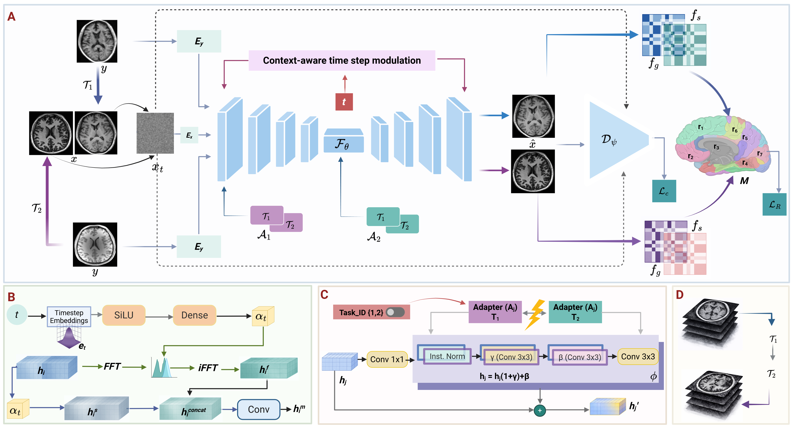

# Multi-Task Diffusion-Adapter Model for MRI Synthesis Across Multiple Field Strengths


**Abstract**  <br />
MRI across different field strengths presents distinct trade-offs in cost, accessibility and diagnostic quality. For instance, low-field scanners provide a portable and cost-effective method but produce images with a lower signal-to-noise ratio, while ultra-high-field scanners give higher resolution imaging yet remain limited in access. Deep learning-based synthesis can bridge these quality gaps, but existing methods address each field-strength transition independently, as multiple synthesis directions within a single framework are challenging due to different degradation characteristics, requiring distinct recovery strategies across the enhancement tasks. To address this, we propose an adaptive multi-task diffusion approach that supports multiple cross-field synthesis. As each task demands different forms of structural recovery, we introduce context-aware feature modulation conditioned on the noise level to regulate coarse reconstruction and fine-detail refinement during the synthesis. We also introduce region-specific anatomical constraints to further ensure the structural fidelity of the synthetic results. Experiments on paired 64mT, 3T, 7T brain MRI demonstrate accurate synthesis across field-strength transitions, with downstream task performance further validating the effective enhancement.

**Architecture**  <br />



**System Requirement**  <br />
All the experiments are conducted on Ubuntu 20.04 Focal version with Python 3.8.

To train the model with the given settings, the system requires a GPU with at least 40GB. All the experiments are conducted on two Nvidia A40 GPUs. (Not required any non-standard hardware)

***Installation Guide***  <br />
Prepare an environment with python>=3.8 and install dependencies
```
pip install -r requirements.txt
```

**Dataset Preparation**  <br />
The experiments are conducted on an in-house paired 64mT-3T and 3T-7T dataset,
  * UNC 3T-7T Dataset : [https://springernature.figshare.com/articles/dataset/UNC_Paired_3T-7T_Dataset/23706033](https://springernature.figshare.com/articles/dataset/UNC_Paired_3T-7T_Dataset/23706033)
    
First, extract the middle axial slices of each nifti file normalize and save as .npy 
To derive high-field segmentations, use [SynthSeg++](https://github.com/BBillot/SynthSeg/tree/master) and similarly save segmentations as .npy
```

data/
├── T1/
│   ├── train/
│   │   ├── lf_t1.npy
│   │   └── hf_t1.npy
│   │   └── 3T_t1.npy
│   │   └── 7T_t1.npy
│   │   └── hf_segs.npy
│   │   └── uhf_segs.npy
│   ├── test/
│   │   ├── lf_t1.npy
│   │   └── hf_t1.npy
│   │   └── 3T_t1.npy
│   │   └── 7T_t1.npy
│   ├── val/
│   │   ├── lf_t1.npy
│   │   └── hf_t1.npy
│   │   └── 3T_t1.npy
│   │   └── 7T_t1.npy
```


**Train Model**  <br />
To train the model on the multi-field datasets.
```
python train.py --image_size 256 --exp exp_multiField --num_channels 1 --num_channels_dae 64 --ch_mult 1 2 4 --num_timesteps 4 --num_res_blocks 2 --batch_size 3 --num_epoch 30 --ngf 64 --embedding_type positional --ema_decay 0.999 --r1_gamma 1. --z_emb_dim 256 --lr_d 1e-4 --lr_g 1.6e-4 --lazy_reg 10 --num_process_per_node 3
```
**Hyperparameter Setting**  <br />
<table style="border-collapse:collapse; width:100%; font-family:Arial, sans-serif; font-size:14px;">
  <thead>
    <tr style="border-top:2px solid #000; border-bottom:2px solid #000;">
      <th style="text-align:left; padding:6px 8px;">Task</th>
      <th style="text-align:left; padding:6px 8px;">Contrast</th>
      <th style="text-align:center; padding:6px 8px;">PSNR (dB)</th>
      <th style="text-align:center; padding:6px 8px;">SSIM (%)</th>
      <th style="text-align:center; padding:6px 8px;">MAE (%)</th>
      <th style="text-align:center; padding:6px 8px;">Timesteps</th>
      <th style="text-align:center; padding:6px 8px;">&#955;<sub>c</sub></th>
      <th style="text-align:center; padding:6px 8px;">&#955;<sub>s</sub></th>
      <th style="text-align:center; padding:6px 8px;">&#955;<sub>R</sub></th>
      <th style="text-align:center; padding:6px 8px;">Batch size</th>
    </tr>
  </thead>
  <tbody>
    <tr style="border-bottom:1px solid #000;">
      <td style="text-align:left; padding:6px 8px;">ULF &#8594; HF</td>
      <td style="text-align:left; padding:6px 8px;">T1w</td>
      <td style="text-align:center; padding:6px 8px;">20.54 &plusmn; 1.71</td>
      <td style="text-align:center; padding:6px 8px;">75.74 &plusmn; 5.88</td>
      <td style="text-align:center; padding:6px 8px;">4.78 &plusmn; 1.17</td>
      <td style="text-align:center; padding:6px 8px;">4</td>
      <td style="text-align:center; padding:6px 8px;">1.0</td>
      <td style="text-align:center; padding:6px 8px;">1.0</td>
      <td style="text-align:center; padding:6px 8px;">0.3</td>
      <td style="text-align:center; padding:6px 8px;">1</td>
    </tr>
    <tr style="border-bottom:1px solid #000;">
      <td style="text-align:left; padding:6px 8px;">ULF &#8594; HF</td>
      <td style="text-align:left; padding:6px 8px;">T2w</td>
      <td style="text-align:center; padding:6px 8px;">22.40 &plusmn; 1.54</td>
      <td style="text-align:center; padding:6px 8px;">79.64 &plusmn; 7.58</td>
      <td style="text-align:center; padding:6px 8px;">3.75 &plusmn; 0.94</td>
      <td style="text-align:center; padding:6px 8px;">4</td>
      <td style="text-align:center; padding:6px 8px;">1.0</td>
      <td style="text-align:center; padding:6px 8px;">1.0</td>
      <td style="text-align:center; padding:6px 8px;">0.3</td>
      <td style="text-align:center; padding:6px 8px;">1</td>
    </tr>
    <tr style="border-bottom:1px solid #000;">
      <td style="text-align:left; padding:6px 8px;">HF &#8594; UHF</td>
      <td style="text-align:left; padding:6px 8px;">T1w</td>
      <td style="text-align:center; padding:6px 8px;">19.38 &plusmn; 1.25</td>
      <td style="text-align:center; padding:6px 8px;">72.71 &plusmn; 5.87</td>
      <td style="text-align:center; padding:6px 8px;">5.48 &plusmn; 1.40</td>
      <td style="text-align:center; padding:6px 8px;">4</td>
      <td style="text-align:center; padding:6px 8px;">1.0</td>
      <td style="text-align:center; padding:6px 8px;">1.0</td>
      <td style="text-align:center; padding:6px 8px;">0.3</td>
      <td style="text-align:center; padding:6px 8px;">1</td>
    </tr>
    <tr style="border-bottom:2px solid #000;">
      <td style="text-align:left; padding:6px 8px;">HF &#8594; UHF</td>
      <td style="text-align:left; padding:6px 8px;">T2w</td>
      <td style="text-align:center; padding:6px 8px;">21.30 &plusmn; 1.71</td>
      <td style="text-align:center; padding:6px 8px;">68.86 &plusmn; 10.10</td>
      <td style="text-align:center; padding:6px 8px;">5.53 &plusmn; 1.48</td>
      <td style="text-align:center; padding:6px 8px;">4</td>
      <td style="text-align:center; padding:6px 8px;">1.0</td>
      <td style="text-align:center; padding:6px 8px;">1.0</td>
      <td style="text-align:center; padding:6px 8px;">0.3</td>
      <td style="text-align:center; padding:6px 8px;">1</td>
    </tr>
  </tbody>
</table>


**Test Model**  <br />
```
python test.py --image_size 256 --exp exp_multiField  --num_channels 1 --num_channels_dae 64 --ch_mult 1 2 4 --num_timesteps 4 --num_res_blocks 2 --batch_size 1 --embedding_type positional  --z_emb_dim 256  --gpu_chose 0 --input_path '/data/T1' --output_path '/results'
```

**Acknowledgements**  <br />
This repository makes liberal use of code from [Tackling the Generative Learning Trilemma](https://github.com/NVlabs/denoising-diffusion-gan) and [SynDiff](https://github.com/icon-lab/SynDiff)
